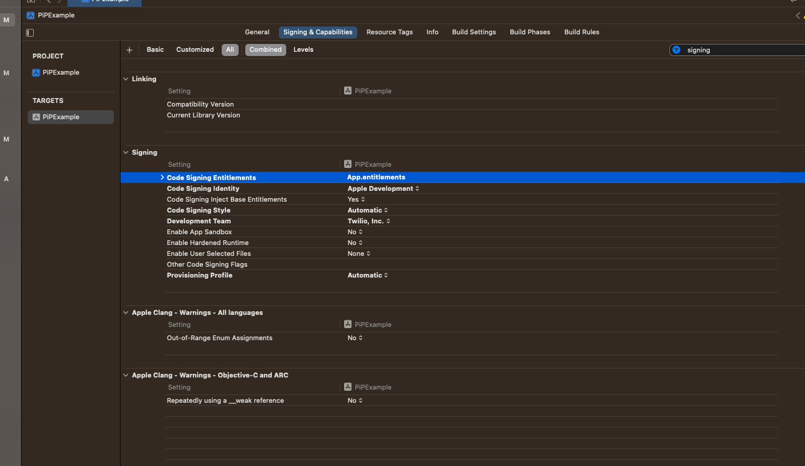
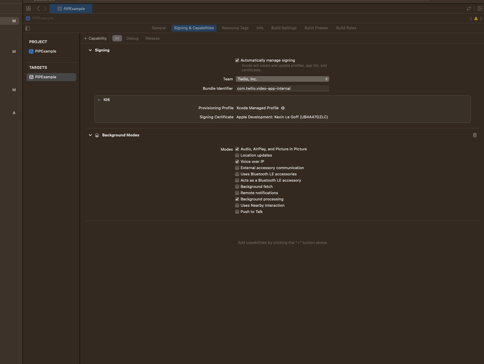

# Twilio video iOS quickstart Picture in Picture integration guide.

This quickstart aims to help Twilio video iOS SDK users with the integration of Picture in Picture as well as 
supporting camera multitasking.

## Camera Multitasking

### Adding support for camera multitasking via the entitlement

From iOS 13.5+ apps can request the `com.apple.developer.avfoundation.multitasking-camera-access` entitlement to be able to use the camera while an other application is in foreground. 

The entitlement needs to be requested to Apple. This can be done [here](https://developer.apple.com/contact/request/multitasking-camera-access/)

Once you have received the entitlement it can be addded to your app by 

1. Create an App.entitlment file with the following content

```
<?xml version="1.0" encoding="UTF-8"?>
<!DOCTYPE plist PUBLIC "-//Apple//DTD PLIST 1.0//EN" "http://www.apple.com/DTDs/PropertyList-1.0.dtd">
<plist version="1.0">
<dict>
	<key>com.apple.developer.avfoundation.multitasking-camera-access</key>
	<true/>
</dict>
</plist>
```

2. Referencing the entitlement file in the build setting.



3. Add the capablity Background Mode for Audio, AirPlay and Picture in Picture
as well as Voice over IP




### From iOS 16+ APIs and Twilio Video iOS 5.7.0 on a restricted set of devices

Starting from iOS 16.0 camera mutlitasking is supported on a small subset of iPad via the following APIs
https://developer.apple.com/documentation/avkit/accessing_the_camera_while_multitasking_on_ipad

From [Twilio 5.7.0](https://www.twilio.com/docs/video/changelog-twilio-video-ios-latest#570-june-14-2023) clients can use the following APIs from Twilio iOS Video SDK to enable camera multitasking.

```swift
func makeCameraSource() -> CameraSource? {
    let options = CameraSourceOptions() { builder in
        if let scene = UIApplication.shared.windows.filter({ $0.isKeyWindow }).first?.windowScene {
            builder.orientationTracker = UserInterfaceTracker(scene: scene)
        }
        
        if #available(iOS 16.0, *) {
            builder.enableCameraMultitasking = self.appSettingStore.isCameraMultitaskingEnabled
        }
    }
    return CameraSource(options: options, delegate: nil)
}
```

The camera multitasking will be enabled if the device supports it. There is no official documentation on what exact devices support the feature (ie [isMultitaskingCameraAccessSupported](https://developer.apple.com/documentation/avfoundation/avcapturesession/4013227-ismultitaskingcameraaccessenable#:~:text=in%20page%20link-,var%20isMultitaskingCameraAccessSupported%3A%20Bool,-A%20Boolean%20value) is returning `true`). But here is a [link to a thread](https://developer.apple.com/forums/thread/710193?answerId=727571022#727571022)  from an apple forum where some of the device (mainly newest iPads) supported are mentionned.


